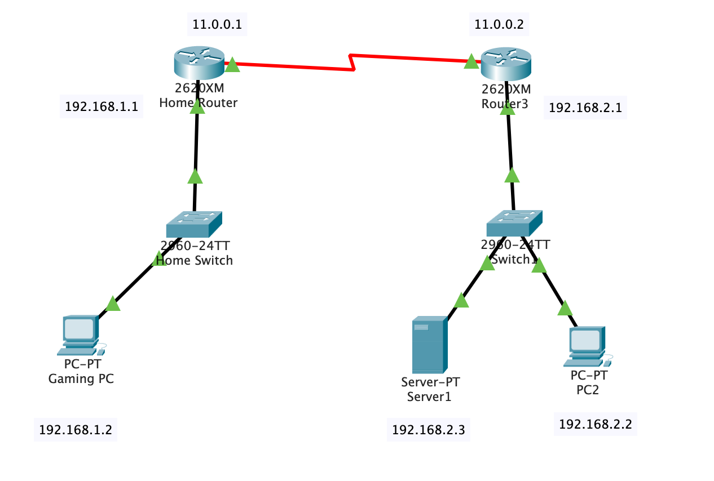

# Networks

Networks are the means by which multiple computer systems can be connected together for the purposes of sharing resources. There are a variety of network models you need to understand, so let's see how those developed by telling a story.

## A Law Firm

A law firm have just moved into their offices. They employ the following:

* Lawyer - The courtroom presence of the firm, maintains files on clients and organises their defence
* Investigator - Gathers intel on their cases
* Accountant - keeps track of incomings & outgoings

### First Setup - Independent Machines

Initially they each have their own computer, but they are not networked in any way. Each employee does their job largely in isolation. When they need to share files they use a USB stick to move files from one machine to another. Here is a diagram of this initial setup.

### Second Setup - Peer to Peer file sharing

After a while, they become rather tired of having to copy files using the USB stick, so they decide to network the machines together. For this they invest in a [Switch](https://en.wikipedia.org/wiki/Network_switch) and connect the machines to form a Local Area Network \(LAN\). A LAN is a network that

* Covers a small geographical area
* The hardware is usually owned by a single organisation

Networking their computers gives the following benefits

* Easier to share files \(and other resources like printers\)

But it incurs the following risks:

* Viruses can spread more easily, with constant connection between machines
* Cost of network hardware \(although at this stage, relatively low\)

The three employees still store their files on their own machines, but they are able to see the files on the other machines. This model of sharing is known as **Peer to Peer**. Characteristics of this are

* All machines are equal, they have the same role of storing, providing and accessing files
* Each peer is responsible for providing its own
  * Backup
  * Security

The advantages of peer to peer are:

* Simple and cheap to setup
* No dependency on a single machine
* Easy to maintain, no specialist hardware/software required

The disadvantages of sharing files this way are

* Each machine has to maintain its own backups/security
* It is harder to keep the files organised \(taken a single logical set of files\), since different bits of data can be found on different machines
* Network is less secure, due to all machines having equal roles and rights.

The network now looks like this.

### Third Setup - Client Server

Once the firm grows in size, it becomes necessary to take on an additional Lawyer, this means that the files for court cases get split awkwardly across both Lawyer machines and it becomes apparent that a new solution will be required.

The company invest in a Server to host all their files in a single well organised system. The server does the following:

* Server controls access to a single file store
* Server manages printing jobs
* Server provides email services
* Server runs backups centrally
* Server provides security for all the data in one place.

Clients then simply access the resources on the server. The advantages are:

* Easier to manage security of files
* Easier to backup files
* Easier to provide software update to all computers

Disadvantages are:

* Can be more expensive to setup and maintain
* Requires specialist IT
* Server is a single point of failure, if it goes down the network becomes near useless.

Our network now looks like this:

### Fourth Setup - The Internet & Cloud

Some time goes by, and it becomes apparent that law firms will need to exchange information with other firms and regulatory bodies over the Internet. The internet is a large array of interconnected networks. In addition to accessing services, the law firms all start to use cloud storage instead of their own locally hosted solutions. This has the following advantages:

* Responsibility for data storage is given out to third party providers, who can distribute your data for resilient physical storage across the world
* No longer need to maintain specialist hardware in house

The risks are

* If the internet connection goes down, you lose all your data.
* You are trusting the third party to store your data alongside other peoples in a secure way, you lose some control

To connect to the internet, a new device called a **Router** will be required. A Router allows different IP networks to interconnect, routing between private LAN's and the global internet IP network. The internet is an example of a **Wide Area Network** \(WAN\) which has the following characteristics:

* Distributed over wide geographical area
* The hardware is owned by several organisations/the connection to the WAN is leased/managed by a third party.

The system now looks like this:

Our law firm LAN still has a server, but it is only providing DHCP in this network, most real LANs get this functionality from a single box \(usually referred to as a router, but actually contains a Server, Router and Switch all in one\).

## Cisco Packet Tracer

Cisco Packet tracer can be freely downloaded and used to simulate various network topologies. I have used Packet Tracer version 7.3 to create a few demonstrations of networking.

### Routing Between Two LANs

This shows how to communicate across two LANs with a WAN in between.

